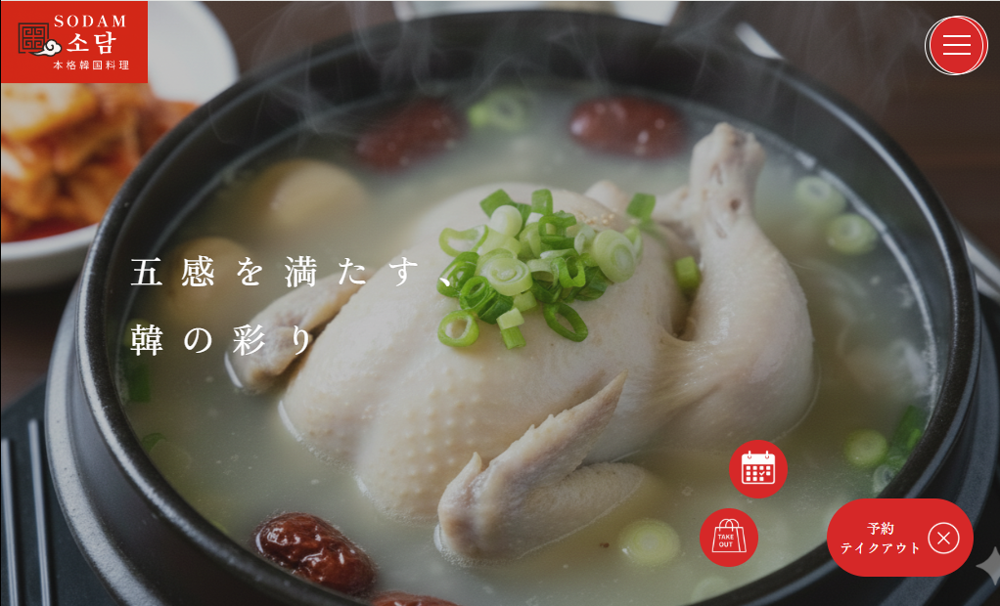

# 本格韓国料理　ソダム（共同制作の架空Webサイト）

## このリポジトリについて

本リポジトリは、共同制作で作成した架空Webサイトのうち、
**自分が担当した機能・実装内容を中心にまとめた解説用リポジトリ**です。

### 概要

本プロジェクトは、**架空の韓国料理店**を想定したWebサイトです。
PHP と MySQL を用いたグループワークとして制作しました。

※ 実在の店舗・サービスとは一切関係ありません。

### 元リポジトリ

https://github.com/okb55-hub/group-project-site.git

### サイトURL

https://nkkmt.stars.ne.jp/koreafood_sodam/html/

---

## 目次

1. [サイトコンセプト・店舗概要](#サイトコンセプト・店舗概要)
2. [自分の役割](#自分の役割)
3. [工夫した点・意識したこと](#工夫した点・意識したこと)
4. [成果・学んだこと](#成果・学んだこと)

---

## サイトコンセプト・店舗概要

- **コンセプト**：本格韓国料理を気軽に楽しめる、おしゃれな店舗
- **ターゲット層**：20～30代女性、ファミリー層
- **座席数**：カウンター6席、テーブル（4人掛け）×8、座敷（8人掛け）×3
- **従業員数**：1日8人程度
- **おすすめメニュー**：
  サムギョプサル、ヤンニョムチキン、サムゲタン、チーズタッカルビ、石焼ビビンバ、チヂミ

チームで話し合い、素材の見つけやすさから韓国料理屋に題材を決めました。
店舗の想定を具体的に設定することで、
どのようなページや機能が必要なのか考えやすくなりました。

---

## 自分の役割

- トップページのデザインカンプ作成
- 店舗情報ページ・プライバシーポリシーページのCSS実装
- **予約ページの実装（フロントエンド・バックエンド）**

### 予約ページの担当範囲の詳細

- **フロントエンド**：デザイン、HTML、CSS
- **バックエンド**：

  - PHP・MySQLを用いた新規予約機能
  - 会員登録機能
  - ログイン／ログアウト機能
  - 予約履歴確認機能
  - 会員情報確認機能

  

---

## 工夫した点・意識したこと

- PHPのエラーが発生しないよう、条件分岐や表示制御を丁寧に実装
- ユーザーの操作性を意識した画面遷移を設計

  - 予約途中でログインした場合でも、操作を中断せずに続きから進める仕様
  - 空席情報をDBから取得する前は、空席欄をぼかすレイヤーを表示し、状態が分かりやすいUIを実装

「実際に利用する立場だったらどう感じるか」を常に考えながら、
細かな挙動や表示にも配慮しました。

---

## 成果・学んだこと

### チーム開発の進め方を学ぶことができた

- GitHubを用いたチーム開発の基本的な流れを実践的に理解できた
- こまめに相談することを意識することで、役割分担が明確になり、
  チームとして統一感のあるWebサイトを完成させることができた

### 前向きにさまざまなことへ挑戦できた

- PHPを用いたパスワードのハッシュ化やプリペアドステートメントなど、
  **安全にデータを扱うための実装を復習・定着させることができた**
- 他のWebサイトを参考にしながら、
  「取り入れたい」と思った機能やデザインを自分なりに調べて実装できた
- Figmaを活用し、チームで共有したイメージをもとに
  デザインカンプを作成し、形に落とし込む経験ができた

本制作を通して、技術面だけでなく、
**考えながら実装する姿勢や、チームで作ることの大切さ**を学ぶことができました。
